# mobintix_ui_kit_demo

Public **sample app** for [**mobintix_ui_kit**](https://pub.dev/packages/mobintix_ui_kit): one place to see the widgets on a real device and copy a minimal integration into your own project.

[](https://pub.dev/packages/mobintix_ui_kit)

**Repository:** [github.com/Mobintix-Package/mobintix_ui_kit_demo](https://github.com/Mobintix-Package/mobintix_ui_kit_demo)

---

## Screenshot reference (`screenshots/`)

This repo includes a **`screenshots/`** folder with the same **PNGs and filenames** as the [**mobintix_ui_kit** pub.dev listing](https://pub.dev/packages/mobintix_ui_kit): a public visual reference for what you see when you run the demo on a phone (captured from the mobile app, not the web renderer).

| File | What it shows |
| --- | --- |
| `home.png` | Home screen — all widget categories |
| `buttons.png` | Button variants — primary, secondary, outline, ghost, danger, icon, text |
| `inputs.png` | Inputs — text fields, password, search, PIN, phone |
| `cards.png` | Cards — basic, tappable, info, list detail |
| `dialogs.png` | Dialogs and bottom sheets |
| `feedback.png` | Feedback — loading, empty, error, toasts |
| `media.png` | Media — network images, avatars |
| `typography.png` | Typography — Material 3 text styles |
| `layout.png` | Layout — spacing, SafeContent, responsive breakpoints |
| `misc.png` | Misc — badges, dividers, shimmer loading |
| `theme.png` | Theme tokens — colors, spacing, sizing, radius, durations |

| Home | Buttons | Inputs | Cards |
|:---:|:---:|:---:|:---:|
| 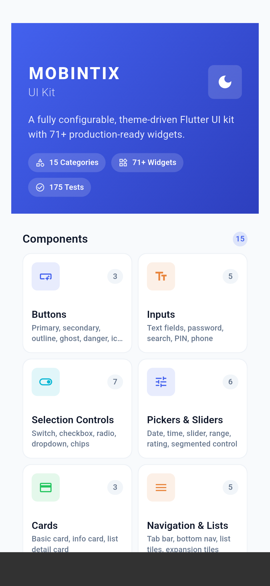 | 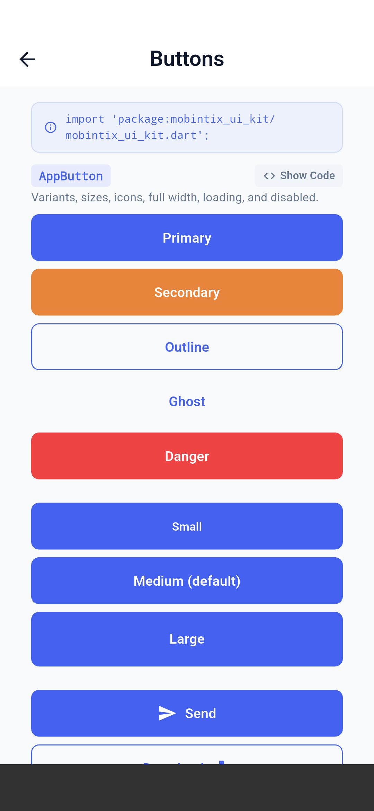 | 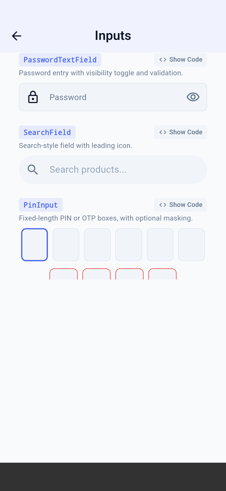 | 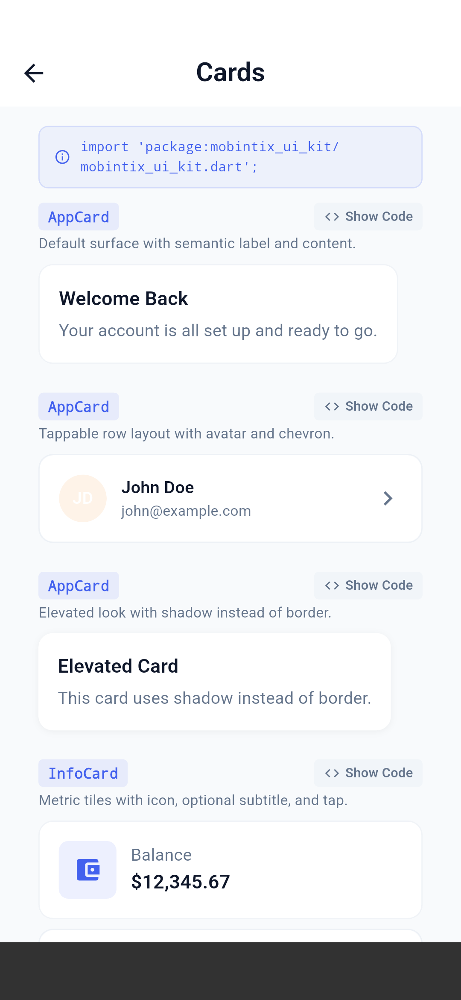 |

| Dialogs | Feedback | Media | Typography |
|:---:|:---:|:---:|:---:|
| 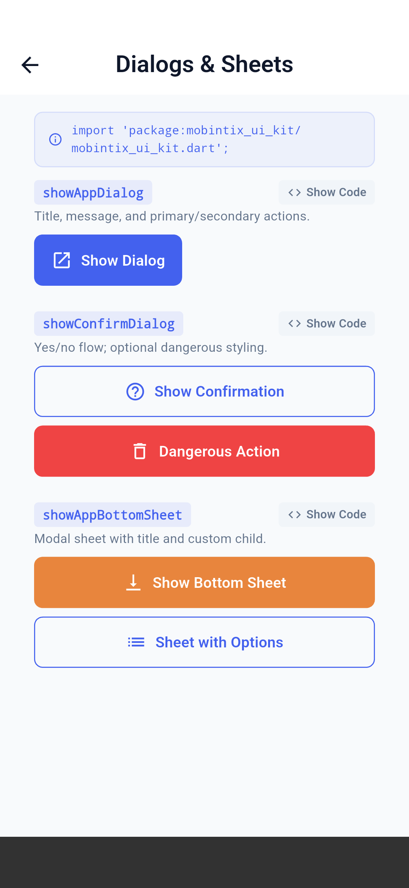 | 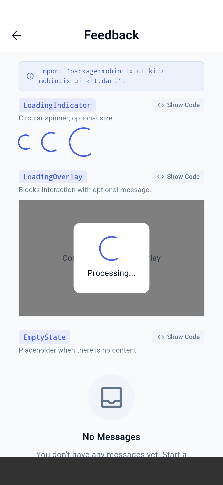 | 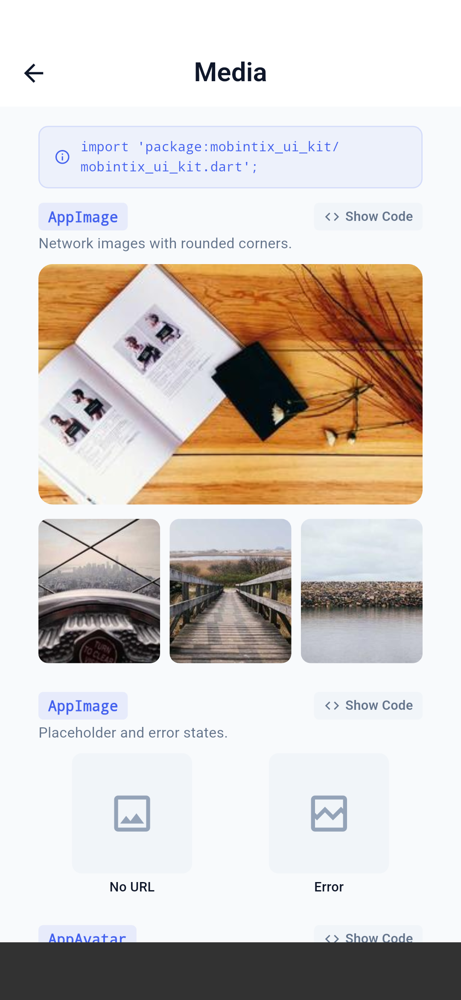 | 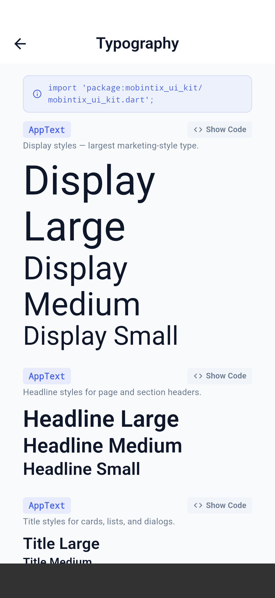 |

| Layout | Misc | Theme |
|:---:|:---:|:---:|
| 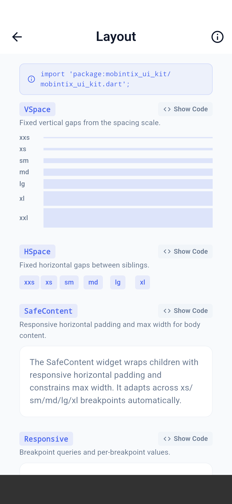 | 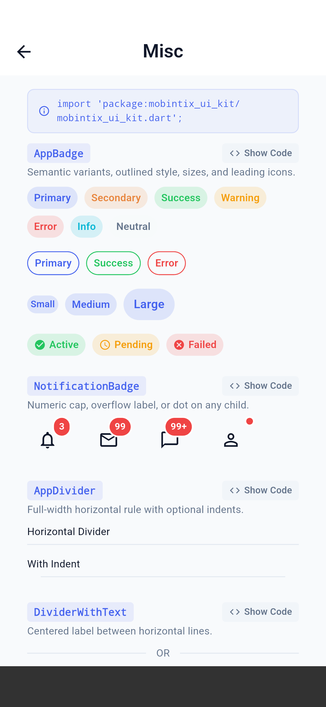 | 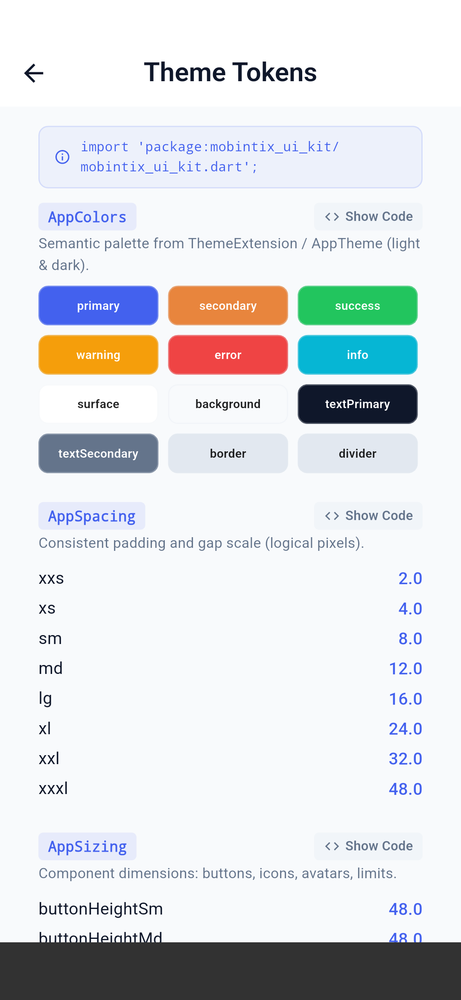 |

---

## Compatibility (aligned with `mobintix_ui_kit`)

| | Version |
| --- | --- |
| **`mobintix_ui_kit`** (pub.dev) | `^0.0.3` |
| **Dart** | `^3.2.0` |
| **Flutter** | `>=3.16.0` |

This repo’s `pubspec.yaml` tracks the same constraints as the published package.

### Published package (verified against pub.dev)

The kit is developed in a **private** Mobintix repository; **releases are public** on [pub.dev](https://pub.dev/packages/mobintix_ui_kit).

| | |
| --- | --- |
| **Latest version** | `0.0.3` (published 2026-04-05) |
| **Changelog** | [pub.dev/packages/mobintix_ui_kit/changelog](https://pub.dev/packages/mobintix_ui_kit/changelog) — e.g. 0.0.3 docs/screenshots/metadata; 0.0.2 Mobintix brand theme and showcase refresh |
| **API docs** | [pub.dev/documentation/mobintix_ui_kit/latest](https://pub.dev/documentation/mobintix_ui_kit/latest/) |
| **This demo** | Depends on **`mobintix_ui_kit: ^0.0.3`** from pub.dev only (`pubspec.lock` → `source: hosted`). No committed `path:` dependency. |

---

## Run the demo

```bash
git clone https://github.com/Mobintix-Package/mobintix_ui_kit_demo.git
cd mobintix_ui_kit_demo
flutter pub get
flutter run
```

The demo depends on the kit **from pub.dev** (not a path to a local clone). To try unpublished kit sources, use a `dependency_overrides` → `path: …` block in `pubspec.yaml` (commented template is in the file).

---

## Use `mobintix_ui_kit` in your own app

### 1. Add the dependency

```yaml
dependencies:
  flutter:
    sdk: flutter
  mobintix_ui_kit: ^0.0.3
```

Run `flutter pub get`.

### 2. Wrap the app with `AppThemeScope`

```dart
import 'package:mobintix_ui_kit/mobintix_ui_kit.dart';

void main() {
  final theme = AppTheme.light();

  runApp(
    AppThemeScope(
      theme: theme,
      child: MaterialApp(
        theme: theme.toThemeData(),
        home: const YourHomePage(),
      ),
    ),
  );
}
```

Dark mode: `AppTheme.dark()` (or build from JSON — see package docs).

### 3. Use tokens and widgets

Inside any child of `AppThemeScope`:

```dart
final colors = context.appColors;
final spacing = context.appSpacing;
```

Then compose with kit widgets (`AppButton`, `AppTextField`, …). Full widget list, JSON theming, and examples: [**package README on pub.dev**](https://pub.dev/packages/mobintix_ui_kit).

### 4. API reference

[pub.dev documentation](https://pub.dev/documentation/mobintix_ui_kit/latest/)

---

## Issues

[github.com/Mobintix-Package/mobintix_ui_kit_demo/issues](https://github.com/Mobintix-Package/mobintix_ui_kit_demo/issues)

---

## For maintainers: regenerating screenshots

Capture on **Android/iOS device or emulator** (not Chrome/web). The script updates **both** this repo’s **`screenshots/`** (public) and **`mobintix_ui_kit/screenshots/`** (private package, for `dart pub publish`).

From **this** repo:

```bash
./tool/export_pub_screenshots.sh optional_device_serial
```

Or manually:

```bash
flutter drive \
  --driver=test_driver/pub_screenshots_driver.dart \
  --target=integration_test/screenshots_test.dart \
  -d your_device_id
cp build/pub_screenshots/*.png screenshots/
cp build/pub_screenshots/*.png /path/to/mobintix_ui_kit/screenshots/
```

Intermediate output: `build/pub_screenshots/` (`flutter drive`, not `flutter run` in Chrome).

---

## License

MIT — see [LICENSE](LICENSE). The **mobintix_ui_kit** package uses the same license ([pub.dev](https://pub.dev/packages/mobintix_ui_kit/license)).
